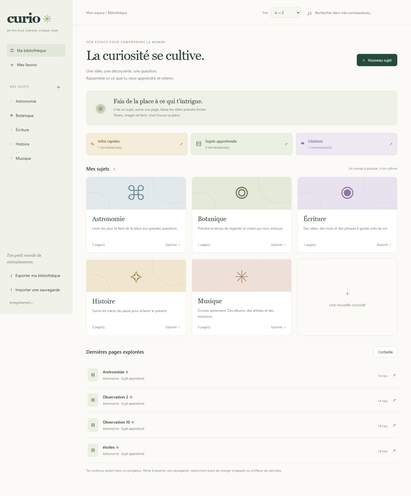
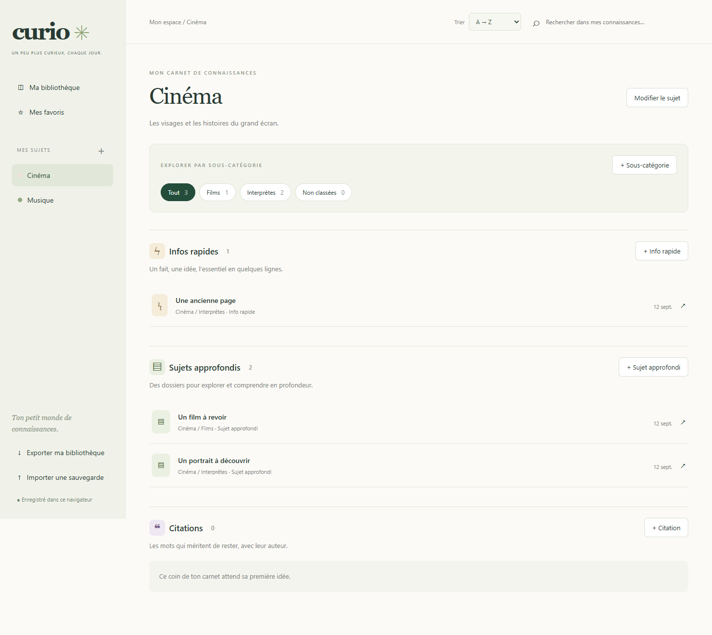
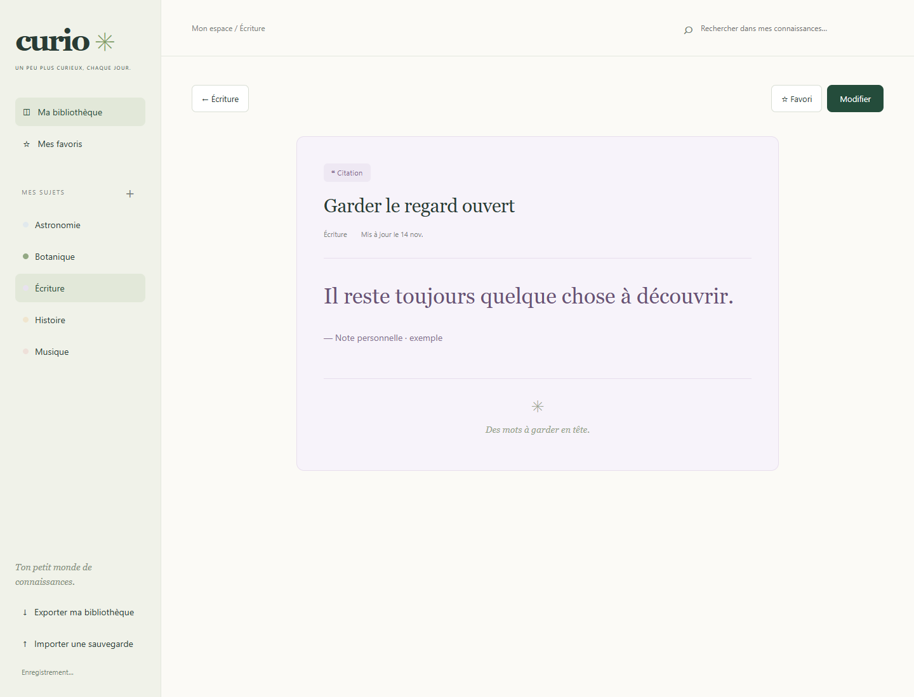
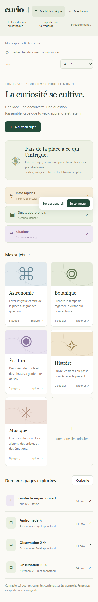

<div align="center">


**Un carnet pour les petites découvertes et les grandes explorations.**

Rassemble ce qui t’intrigue. Écris à ton rythme. Retrouve le plaisir de relire.

[](https://feuille2cedric.github.io/culture-generale/)
[](https://github.com/Feuille2Cedric/culture-generale/actions/workflows/pages.yml)

**En français** &nbsp; · &nbsp; **Sans compte** &nbsp; · &nbsp; **Ordinateur & mobile** &nbsp; · &nbsp; **Tes contenus dans ton navigateur**

[Découvrir](#un-petit-monde-de-connaissances) · [Prendre en main](#de-la-curiosité-à-la-connaissance) · [Sauvegarder](#tes-contenus-restent-à-toi) · [Installer](#faire-tourner-curio)

</div>

---

## Un petit monde de connaissances

Un fait à retenir, un sujet à approfondir, une phrase qui résonne : toutes les connaissances n’ont pas besoin du même espace. **Curio leur donne une place**, dans une bibliothèque personnelle organisée par sujets.

Crée tes propres thèmes, compose tes pages avec des textes, des images et des liens, puis passe en lecture pour profiter de ce que tu as rassemblé. Une palette douce, une typographie de carnet et une navigation simple gardent l’attention sur tes idées.



<sub>Les captures utilisent une bibliothèque de démonstration. L’application démarre vide, prête à accueillir tes propres sujets.</sub>

## Trois formats, trois façons de retenir

| | Format | Pour quoi faire ? | En lecture |
| :--: | :-- | :-- | :-- |
| **ϟ** | **Info rapide** | Un fait, une observation ou une idée en quelques lignes. | Une fiche compacte aux tons sable. |
| **▤** | **Sujet approfondi** | Un dossier pour relier des idées et comprendre en profondeur. | Un article aéré, avec durée de lecture et sommaire dès deux titres de section. |
| **❝** | **Citation** | Des mots marquants avec leur auteur ou leur source. | Une présentation typographique sur fond lavande. |

Chaque sujet possède ces trois sections. Depuis l’accueil, retrouve aussi **toutes tes infos rapides**, **tous tes sujets approfondis** ou **toutes tes citations**, quel que soit leur thème.

### Des sous-catégories à ta façon

Organise un sujet sans mélanger ses différentes facettes : **Cinéma → Acteurs, Films**, **Musique → Albums, Ballets, Singles**, ou toute autre sous-catégorie de ton choix.

Dans un sujet, **+ Sous-catégorie** crée un nouveau classement. Les filtres permettent ensuite de consulter toutes les connaissances, une sous-catégorie ou les pages **Non classées**. Les trois formats restent disponibles dans chaque filtre. Une page créée depuis un filtre est automatiquement rangée dans cette sous-catégorie.

Le classement se modifie aussi dans l’éditeur. Tu peux renommer ou supprimer une sous-catégorie : ses pages restent conservées et redeviennent non classées. Déplacer une page vers un autre sujet réinitialise sa sous-catégorie pour éviter un classement incohérent.

Les sous-catégories sont sauvegardées et incluses dans les exports/imports. Pour les pages Notion converties avec leurs métadonnées d’origine, les anciennes sous-rubriques sont récupérées automatiquement, sans modifier leurs textes. Les anciens exports Curio restent compatibles.





## De la curiosité à la connaissance

**01 · Choisir un terrain d’exploration**<br>
Crée un sujet, donne-lui un nom, une description et une couleur. Astronomie, cinéma, botanique : la bibliothèque suit tes envies.

**02 · Donner forme à une idée**<br>
Choisis un format, puis compose ta page avec l’éditeur par blocs. Ajoute du texte, des titres, des citations, des images et des liens. Déplace les blocs avec les flèches, ajuste la largeur et l’alignement des images, et ajoute leurs légendes.

**03 · Enregistrer et relire**<br>
Le bouton **Enregistrer**, au bas de l’éditeur, sauvegarde puis ouvre la vue de lecture. **Modifier** te ramène à l’écriture. Une sauvegarde automatique protège aussi tes modifications pendant l’édition.

**04 · Retrouver et faire grandir**<br>
Recherche dans les titres, les textes, les auteurs et les noms des sujets. Garde des favoris, déplace une page vers un autre sujet ou change son format à tout moment.

### Une bibliothèque qui reste en ordre

- **A → Z** : le tri par défaut, adapté à l’alphabet français et aux titres accentués.
- **Z → A** : l’ordre alphabétique inverse.
- **Plus récents** : les dernières pages modifiées et les derniers sujets ajoutés d’abord.

Le choix est mémorisé dans ton navigateur. Il s’applique aux sujets, à la navigation latérale et aux listes de connaissances, y compris la recherche et les favoris. Les nombres suivent un ordre naturel : « Observation 2 » précède « Observation 10 ».

La section **Dernières pages explorées** conserve son ordre de consultation pour retrouver rapidement ta lecture précédente.

<details>
<summary><strong>Et sur téléphone ?</strong></summary>

La bibliothèque, les commandes de tri et les pages s’adaptent aux petits écrans. Tu retrouves les mêmes fonctions d’écriture et de lecture.



L’accès au site est possible sur plusieurs appareils ; les données de chaque navigateur restent indépendantes. Pour transférer ta bibliothèque, utilise l’export et l’import.

</details>

## Tes contenus restent à toi

**GitHub Pages héberge l’application. Ton navigateur conserve ta bibliothèque.**

Les sujets et les pages sont enregistrés dans **IndexedDB** ; les images sont stockées séparément dans la même base. Aucun compte ni serveur de données n’est nécessaire. Les contenus saisis dans l’application ne sont pas envoyés au dépôt GitHub.

| Action | Ce qu’elle fait |
| :-- | :-- |
| **Sauvegarde automatique** | Enregistre les changements pendant que tu écris. |
| **Enregistrer** | Attend la réussite de la sauvegarde avant d’ouvrir la lecture. En cas d’erreur, l’éditeur reste ouvert. |
| **Exporter ma bibliothèque** | Télécharge un JSON contenant les sujets, les pages, la corbeille et les images utilisées. |
| **Importer une sauvegarde** | Ajoute son contenu en conservant les pages déjà présentes. |
| **Corbeille** | Permet de restaurer une page mise de côté. |

> [!IMPORTANT]
> Le stockage est propre au navigateur et à l’adresse du site. Il n’y a pas de synchronisation automatique entre appareils. Effacer les données du site peut supprimer ta bibliothèque ; la navigation privée et l’éviction du stockage peuvent aussi la faire disparaître. **Garde régulièrement un export dans un emplacement sauvegardé.**

> [!NOTE]
> Un import ajoute des copies : importer deux fois le même fichier crée des doublons. Les exports peuvent contenir tes informations personnelles ; conserve-les comme tes autres documents.

<details>
<summary><strong>Formats, limites et compatibilité</strong></summary>

- Images : **PNG, JPEG, GIF et WebP**, jusqu’à **12 Mo par image**.
- Sauvegardes : import JSON Curio, jusqu’à **200 Mo par fichier**.
- Capacité totale : dépend du quota accordé par le navigateur.
- Anciennes pages : les pages sans format sont ouvertes comme des sujets approfondis, sans perte de contenu.
- Plusieurs fenêtres : une vérification de version empêche une fenêtre d’écraser silencieusement les modifications d’une autre.
- Mise en page : blocs verticaux, images centrées ou alignées et largeur réglable. Le texte reste du texte brut ; pas de canevas libre ni de texte autour des images.
- Notion : pas d’import HTML ou ZIP direct dans l’application. L’export doit être converti au format JSON Curio avant import.
- Images retirées : leurs fichiers peuvent rester dans le stockage local ; les images qui ne sont plus référencées par aucune page ne sont pas incluses dans les exports.

</details>

## Faire tourner Curio

### Utiliser l’application

**[Ouvrir Curio dans le navigateur →](https://feuille2cedric.github.io/culture-generale/)**

Pas d’installation, de compte ou de clé API.

### Lancer une copie locale

Avec Git et Python installés :

```bash
git clone https://github.com/Feuille2Cedric/culture-generale.git
cd culture-generale
python -m http.server 3355 --bind 127.0.0.1
```

Ouvre ensuite **http://127.0.0.1:3355**. Utilise le serveur local plutôt qu’une ouverture directe du fichier HTML. La bibliothèque locale et celle du site en ligne sont distinctes ; l’export/import permet de passer de l’une à l’autre.

### Déployer sur GitHub Pages

1. Crée une copie du dépôt, avec la branche `main`.
2. Dans **Settings → Pages → Build and deployment → Source**, sélectionne **GitHub Actions**.
3. Lance le workflow **Deploy Curio to GitHub Pages**, ou pousse un commit sur `main`.

Le [workflow inclus](.github/workflows/pages.yml) publie `index.html`, `app.js`, `categories.js`, `style.css` et `favicon.svg`. Les chemins relatifs fonctionnent sous l’adresse d’un dépôt GitHub Pages. Aucun build JavaScript ni serveur applicatif n’est nécessaire.

## Sous le capot

| Élément | Choix |
| :-- | :-- |
| Interface | HTML, CSS et JavaScript natif |
| Typographie | Polices système et Georgia, sans police distante |
| Stockage des connaissances | IndexedDB · base `curio-library` |
| Préférence de tri | `localStorage` · clé `curio-sort-order` |
| Hébergement | GitHub Pages, déployé avec GitHub Actions |
| Vérification | Scénarios de navigateur avec Python et Playwright |

```text
culture-generale/
├── index.html              Structure de l’application
├── app.js                  Édition, lecture, tri et stockage
├── categories.js           Sous-catégories et reprise des classements Notion
├── style.css               Identité visuelle et affichage mobile
├── favicon.svg             Icône Curio
├── docs/                   Visuels du README avec contenus de démonstration
├── test_app.py             Parcours, sauvegardes et compatibilité
├── test_sort.py            Tri et captures de démonstration
├── test_categories.py      Classement, filtres et compatibilité des sauvegardes
└── .github/workflows/
    └── pages.yml           Publication automatique
```

### Vérifier les parcours

Les tests utilisent un navigateur isolé et des données de démonstration. Ils couvrent notamment l’édition, les images, la lecture, les trois formats, l’export/import, les conflits entre fenêtres, les erreurs de sauvegarde et le tri.

```bash
python -m pip install playwright
python test_app.py
python test_sort.py
python test_categories.py
```

Les scripts sont actuellement configurés pour **Google Chrome sous Windows**, au chemin `C:\Program Files\Google\Chrome\Application\chrome.exe`. Adapte `executable_path` si ton installation diffère. `test_sort.py` régénère les captures du dossier `docs/`.

---

<div align="center">


**Une idée aujourd’hui. Un petit monde demain.**

[Ouvrir mon carnet →](https://feuille2cedric.github.io/culture-generale/)

</div>
